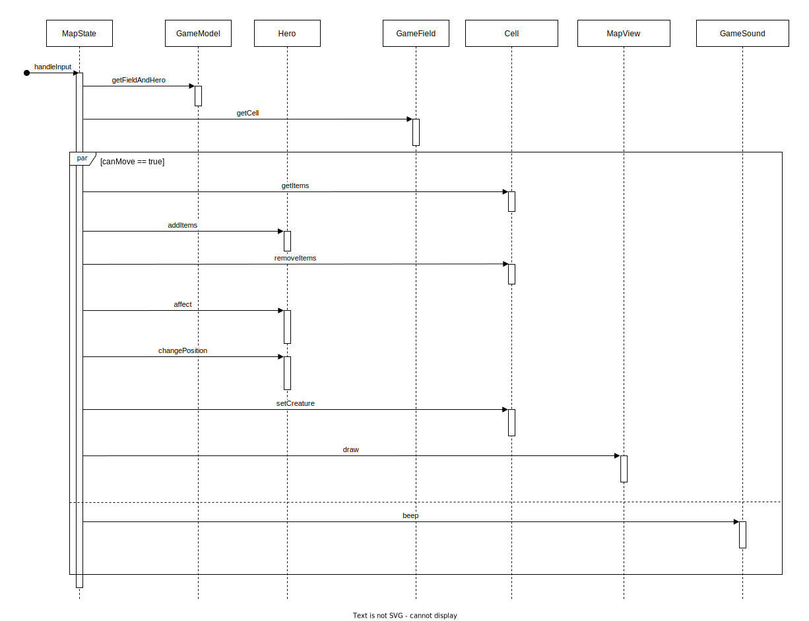

# Архитектура игры HseRogue

## Разработчики
- Бубнов Данил
- Марьин Глеб
- Лучинин Алексей
- Онофрийчук Илья

## Глоссарий
Забег — игра от старта до финальной точки или до смерти

## Общие сведения о системе

### Назначения системы
HseRogue — игра в жанре roguelike с консольной графикой

### Границы системы
- Игра однопользовательская
- Управление с помощью клавиатуры
- Переназначения клавиш нет
- В игре нет прогрессии между забегами
- Сохранений нет
- Игра пошаговая. Без действий игрока ничего происходить не будет
- Есть заранее созданные уровни, а также уровни, которые генерируются с использованием случайности
- Игроки не могут добавлять свои уровни и другой контент
- Размер пользовательского интерфейса нельзя менять
- Графика двумерная
- Игровое поле состоит из блоков, у каждого блока есть координаты x и y, в каждом блоке могут быть размещены одна или несколько игровых сущностей
- Основной язык английский, но должна быть возможность легко добавить перевод на другие языки

### Контекст системы
Игра должна работать прямо на устройствах пользователей в консоли. Должно быть поддержано максимально возможное число платформ

## Architectural drivers

### Технические ограничения
- Для выбранного языка программирования должна быть библиотека для работы с консолью (по типу ncurses)

### Бизнес ограничения
- Для разработки системы будет около 2 месяцев
- Промежуточные результаты должны быть раз в 1-2 недели
- Нужно будет использовать паттерны и шаблоны проектирования при разработке

### Качественные характеристики системы
- Производительность не важна (игра простая с простой графикой)
- Важна готовность системы к изменениям

### Ключевые функциональные требования
- Должна быть консольная графика
- Должен быть персонаж, способный перемещаться по карте
- Должны быть предметы, которые персонаж может подобрать, а затем надеть/снять

## Архитектурные виды

### Роли и случаи использования
Роли:
- Игрок
- Переводчик
- Дизайнер уровней

Случаи использования:
- Игрок хочет сыграть. У него есть не так много времени, игра не должна быть долгой. Значит:
  - Уровней не должно быть слишком много
  - У игры должен быть конец
- Переводчик хочет перевести игру на другой язык. Он не хочет иметь дело с кодом. Значит:
  - Все строковые литералы должны быть вынесены в файл, чтобы переводчик мог добавить такой же файл с переводом на другой язык
- Дизайнер уровней хочет изменить определенный уровень. Он не хочет иметь дело с кодом. Значит:
  - Уровни должны быть вынесены в файлы, чтобы их можно было править независимо от кода

### Типичный пользователь
Имя: Григорий

Возраст: 45 лет

Фото:

Программист, пользуется ОС Linux, пользуется терминалом

В игры особо не играет, но в детстве играл

Во время рабочего времени или после работы сидит с открытым терминалом, хочет отдохнуть. Не чаще 1-2 раз в день

Хочет на время отвлечься от работы или отдохнуть вечером

### Композиция 

Используем **слоистую архитектуру**. Также компоненты похожи на компоненты MVC, только у нас View не имеет доступа к Model. Map/Inventory/Help login — аналоги Controller в MVC

#### Input handler
Ждет ввод с клавиатуры, перенаправляет его в Game logic

#### Game logic
Логика игры. Реализуется с помощью паттерна Состояние. Система может находиться в одном из трех состояний: Map logic, Inventory logic, Help logic

#### Help logic
Показ управления и правил

#### Inventory logic
Работа с инвентарем

#### Map logic
Передвижение игрока по карте, подбор предметов в инвентарь

#### Game model
Содержит текущее состояние игры: что/кто в каком месте на карте находится, у кого сколько жизней, характеристик, что лежит в инвентаре героя, что надето на героя

#### Level generator
Создает карту для уровня из файла или с использованием случайности

#### Help GUI
Позволяет отобразить управление и правила игры

#### Inventory GUI
Позволяет отобразить инвентарь и надетые вещи

#### Map GUI
Позволяет отобразить игровую карту, лог игровых событий и характеристики героя, а также отобразить сообщение (например, при переходе на очередной уровень)

#### GUI library
Позволяет отобразить данные в консоли

### Логическая структура

#### InputHandler
Считывает нажатие клавиш и передает их в State. Считывать нажатия с помощью метода readInput класса Terminal из выбранной библиотеки lanterna

#### State
Состояние игры. От состояния зависит, что будет изображено на экране и что будет происходить при нажатии определенной кнопки пользователем. Метод activate() активирует (выводит на экран нужное изображение) состояние

#### MapState
Состояние передвижения героя по карте.
Содержит логику по проверке и передвижении героя, подборе предметов.
Также показывает игроку текущие характеристики героя.
Из этого состояния можно перейти в любое другое

#### MapFreeModeState
Состояние исследования карты без передвижения героя.
Содержит логику по перемещению курсора и отображении того, что находится в клетке под курсором.
Когда это состояние активируется курсор находится на клетке с героем.
Из этого состояния можно перейти только в основное (MapState)

#### InventoryState
Состояние работы с инвентарем.
Содержит логику просмотра предметов в инвентаре, использование и отмену использования предметов.
Из этого состояния можно перейти только в основное (MapState)

#### HelpState
Состояние просмотра информации об игре.
Показывает назначение клавиш.
Из этого состояния можно перейти только в основное (MapState)

#### LevelGenerator
Позволяет сгенерировать уровень (игровое поле). Уровень генерируется без героя, но возвращается его позиция

#### GameModel
Модель игры: текущее состояние игрового поля, герой

#### GameField
Игровое поле, состоит из клеток, имеет размеры height на width

#### Cell
Клетка игрового поля. У клетки есть тип. На клетке могут находиться предметы и до 1 существа

#### GroundType
Тип клетки

#### Item
Предмет. Предмет может быть одноразовым или многоразовым. Предмет сам знает, как он подействует на героя. Предмет может быть неприменим в данный момент к герою (нельзя надеть 2 шляпы, например)

#### Creature
Существо. Может передвигаться по карте, имеет здоровье

#### Hero
Персонаж, которым управляет игрок. Может носить вещи

#### MapView
Чтобы изменения показались на экране, нужно вызвать метод show()

Макет для MapState:

Макет для MapFreeModeState:

#### InventoryView
Чтобы изменения показались на экране, нужно вызвать метод show()

Макет:

#### HelpView
Чтобы изменения показались на экране, нужно вызвать метод show()

Макет:

#### Drawable
Изображение, которое можно менять

#### Image
Реализует интерфейс библиотеки lanterna, делегируя запросы TextImage.
Умеет создать ссылку на часть себя для удобства

#### GameWindow
Игровое окно, может создать Image, который оно сможет отобразить

#### GameSound
Позволять издать звуковой сигнал

### Взаимодействия и состояния

#### Диаграмма состояний игры

При запуске программы игра сразу оказывается в состоянии `MapState`, в котором пользователь может перемещаться по карте.
Переход в состояние `MapFreeModeState`, в котором игрок может исследовать карту без перемещения персонажа, осуществляется 
при нажатии пользователем определённой клавиши. Возвращение назад происходит при нажатии клавиши `назад`.
Аналогично с двумя оставшимися состояниями:
* `InventoryState` -- перед пользователем открыт инвентарь
* `HelpState` -- перед пользователем открыта информации о настройках игры

Таким образом, основное состояние -- это `MapState`, для того чтобы перейти в любое другое или выйти из 
игры нужно в первую очередь вернуться в данное состояние.

#### Диаграмма обработки очередного хода игрока

Всё начинается с того, что у `MapState` вызывается метод `handleInput`,
в который передаётся действие `Event`, которое совершил пользователь. Данный `Event` 
передаётся в `GameModel`. `GameModel`, в первую очередь, узнаёт у героя его позицию, после этого пытается
подвинуть его в нужную клетку, вызывая метод `tryMove` у `GameField`. `GameField` проверяет, что игрока можно подвинуть 
нужным образом. Если это возможно, то сдвигает его. При этом новая клетка может быть особенной (например, быть в огне),
это оказывает некоторое влияние на героя, поэтому в диаграмме присутствует действие `affect`. `GameFiled`, в итоге,
возвращает конечную позицию игрока. Если на новой клетке что-то уже было, то герой должен произвести некоторое действие. Именно это и показно через метод `doAction`. `GameModel` возвращает `MapState` информацию о том, как 
прошел ход, если действие, которое хотел совершить пользователь, на самом деле не может быть совершено, то `MapState` 
с помощью `GameSound` уведомляет об этом игрока. И конечным действием, оказывается отрисовка нового состояния игры 
с помощью `MapView`

## Rationale — причины принятых решений, за/против, альтернативы
Выбран язык **Kotlin**, так как у него достаточно производительности, есть библиотека для работы с консолью, хорошо с кроссплатформенностью, и наша команда хорошо знакома с этим языком программирования. То есть он удовлетворяет всем требованиям к системе. На других языках нам будет либо сложнее писать из-за отсутствия сборщика мусора (C/C++), либо из-за отсутствия опыта (Python, Go)

Для работы с консолью выбрана библиотека [lanterna](https://github.com/mabe02/lanterna), так как в ней есть все нужное, её API прост, и она до сих пор поддерживается. Альтернативы [JCurses](https://sourceforge.net/projects/javacurses) и [Charva](http://www.pitman.co.za/projects/charva/index.html) не поддерживаются и не имеют никаких преимуществ перед lanterna. Альтернативы найдены по запросу `ncurses java` в [статье](http://rememberjava.com/cli/2017/01/22/ncurses_terminal_libs.html)
