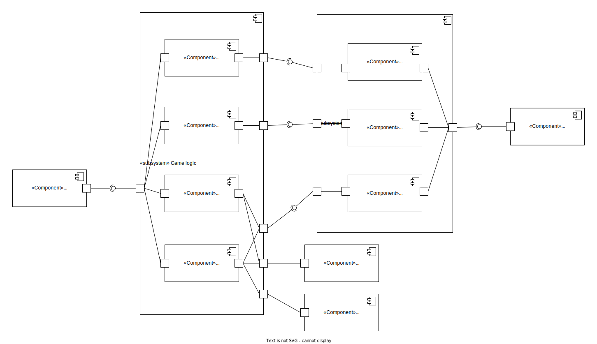

# Архитектура игры HseRogue

## Разработчики
- Бубнов Данил
- Марьин Глеб
- Лучинин Алексей
- Онофрийчук Илья

## Глоссарий
Забег — игра от старта до финальной точки или до смерти

## Общие сведения о системе

### Назначения системы
HseRogue — игра в жанре roguelike с консольной графикой

### Границы системы
- Игра однопользовательская
- Управление с помощью клавиатуры
- Переназначения клавиш нет
- В игре нет прогрессии между забегами
- Сохранений нет
- Игра пошаговая. Без действий игрока ничего происходить не будет
- Есть заранее созданные уровни, а также уровни, которые генерируются с использованием случайности
- Игроки не могут добавлять свои уровни и другой контент
- Размер пользовательского интерфейса нельзя менять
- Графика двумерная
- Игровое поле состоит из блоков, у каждого блока есть координаты x и y, в каждом блоке могут быть размещены одна или несколько игровых сущностей
- Основной язык английский, но должна быть возможность легко добавить перевод на другие языки

### Контекст системы
Игра должна работать прямо на устройствах пользователей в консоли. Должно быть поддержано максимально возможное число платформ

## Architectural drivers

### Технические ограничения
- Для выбранного языка программирования должна быть библиотека для работы с консолью (по типу ncurses)

### Бизнес ограничения
- Для разработки системы будет около 2 месяцев
- Промежуточные результаты должны быть раз в 1-2 недели
- Нужно будет использовать паттерны и шаблоны проектирования при разработке

### Качественные характеристики системы
- Производительность не важна (игра простая с простой графикой)
- Важна готовность системы к изменениям

### Ключевые функциональные требования
- Должна быть консольная графика
- Должен быть персонаж, способный перемещаться по карте
- Должны быть предметы, которые персонаж может подобрать, а затем надеть/снять

## Архитектурные виды

### Роли и случаи использования
Роли:
- Игрок
- Переводчик
- Дизайнер уровней

Случаи использования:
- Игрок хочет сыграть. У него есть не так много времени, игра не должна быть долгой. Значит:
  - Уровней не должно быть слишком много
  - У игры должен быть конец
- Переводчик хочет перевести игру на другой язык. Он не хочет иметь дело с кодом. Значит:
  - Все строковые литералы должны быть вынесены в файл, чтобы переводчик мог добавить такой же файл с переводом на другой язык
- Дизайнер уровней хочет изменить определенный уровень. Он не хочет иметь дело с кодом. Значит:
  - Уровни должны быть вынесены в файлы, чтобы их можно было править независимо от кода

### Типичный пользователь
Имя: Григорий

Возраст: 45 лет

Фото:

Программист, пользуется ОС Linux, пользуется терминалом

В игры особо не играет, но в детстве играл

Во время рабочего времени или после работы сидит с открытым терминалом, хочет отдохнуть. Не чаще 1-2 раз в день

Хочет на время отвлечься от работы или отдохнуть вечером

### Композиция 

Используем **слоистую архитектуру**. Также компоненты похожи на компоненты MVC, только у нас View не имеет доступа к Model. Map/Inventory/Help login — аналоги Controller в MVC

#### Input handler
Ждет ввод с клавиатуры, перенаправляет его в Game logic

#### Game logic
Логика игры. Реализуется с помощью паттерна Состояние. Система может находиться в одном из трех состояний: Map logic, Inventory logic, Help logic

#### Help logic
Показ управления и правил

#### Inventory logic
Работа с инвентарем

#### Map logic
Передвижение игрока по карте, подбор предметов в инвентарь

#### Game model
Содержит текущее состояние игры: что/кто в каком месте на карте находится, у кого сколько жизней, характеристик, что лежит в инвентаре героя, что надето на героя

#### Level generator
Создает карту для уровня из файла или с использованием случайности

#### Help GUI
Позволяет отобразить управление и правила игры

#### Inventory GUI
Позволяет отобразить инвентарь и надетые вещи

#### Map GUI
Позволяет отобразить игровую карту, лог игровых событий и характеристики героя, а также отобразить сообщение (например, при переходе на очередной уровень)

#### GUI library
Позволяет отобразить данные в консоли

### Логическая структура
диаграмма классов и её текстовое описание

может быть по одной диаграмме классов на компонент, но все связи должны быть прослеживаемы — то есть нужны и классы из других компонентов с полностью квалифицированными именами, но без атрибутов/операций, если на них ссылаетесь

### Взаимодействия и состояния
диаграммы последовательностей и конечных автоматов и их текстовое описание — даже если для вашей архитектуры они не очень полезны, нарисуйте, потренироваться

## Rationale — причины принятых решений, за/против, альтернативы
Вообще, всё это приводится в деталях при описании каждого View, в конце документа только summary. Это нужно, чтобы при изменении требований/ограничений/контекста проекта быстро пробежаться по аргументации и понять, какие аргументы уже неприменимы

Выбран язык **Kotlin**, так как у него достаточно производительности, есть библиотека для работы с консолью, хорошо с кроссплатформенностью, и наша команда хорошо знакома с этим языком программирования. То есть он удовлетворяет всем требованиям к системе. На других языках нам будет либо сложнее писать из-за отсутствия сборщика мусора (C/C++), либо из-за отсутствия опыта (Python, Go)

Для работы с консолью выбрана библиотека [lanterna](https://github.com/mabe02/lanterna), так как в ней есть все нужное, её API прост, и она до сих пор поддерживается. Альтернативы [JCurses](https://sourceforge.net/projects/javacurses) и [Charva](http://www.pitman.co.za/projects/charva/index.html) не поддерживаются и не имеют никаких преимуществ перед lanterna. Альтернативы найдены по запросу `ncurses java` в [статье](http://rememberjava.com/cli/2017/01/22/ncurses_terminal_libs.html)

