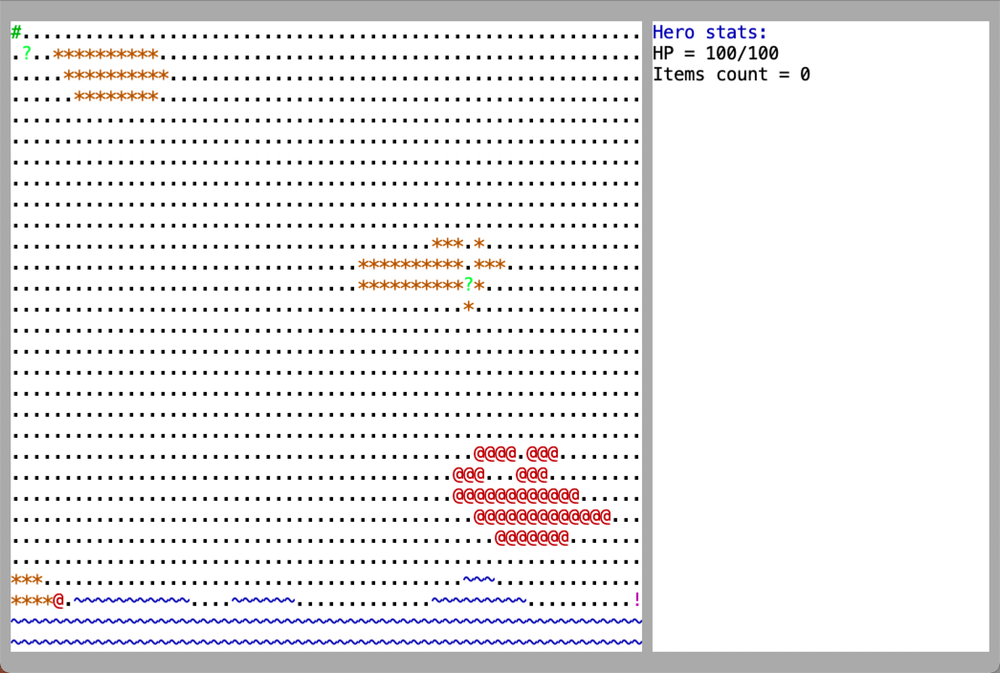
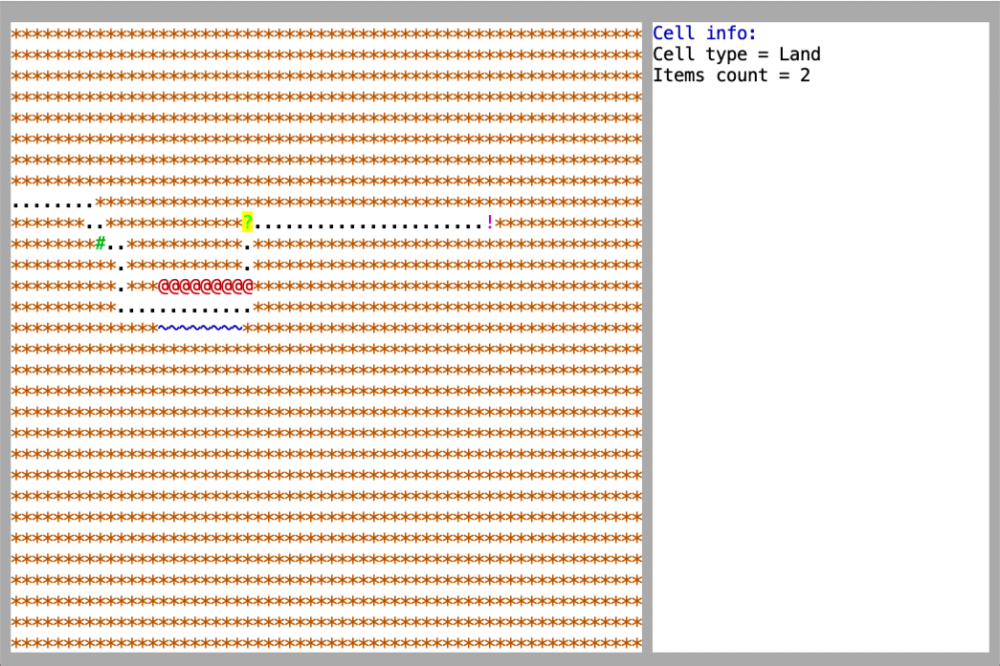
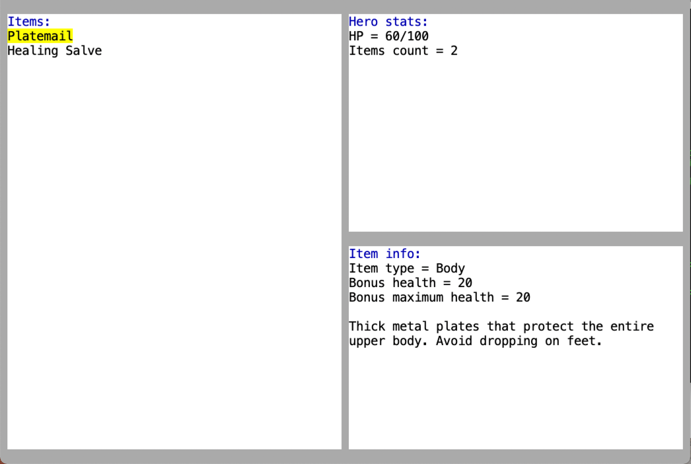
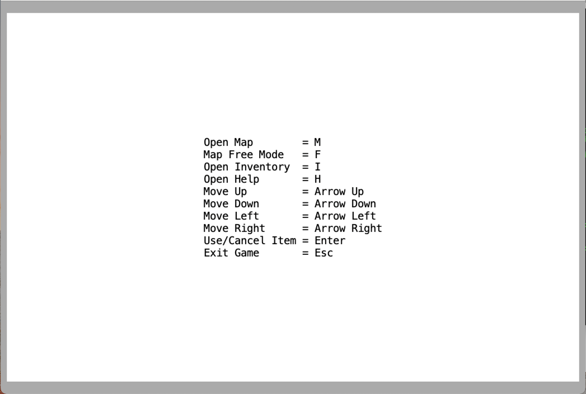

# HSE-SD-Course-Roguelike
[](https://codecov.io/gh/KaperD/HSE-SD-Course-Roguelike)

## Build and run
We use `Gradle` as build system

```shell
./gradlew installDist # build and make executable script
./build/install/hserogue/bin/hserogue # run in terminal
./build/install/hserogue/bin/hserogue --window # run in separate window
```

## Control
Open it by pressing `h`

## Screenshots

### Map


### Map Free Mode


### Inventory


### Help

